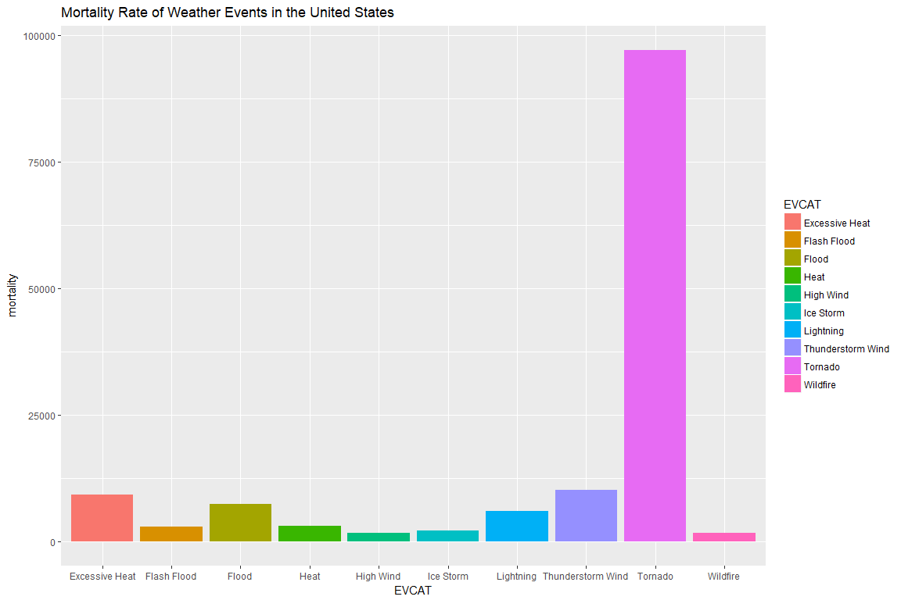

# Preparation and Pre-processing of Data
Data on weather events was downloaded from https://d396qusza40orc.cloudfront.net/repdata%2Fdata%2FStormData.csv.bz2. Weather events were classified based on the documentation provided here: https://d396qusza40orc.cloudfront.net/repdata%2Fpeer2_doc%2Fpd01016005curr.pdf
### Loading necessary libraries

```r
knitr::opts_chunk$set(fig.width=12, fig.height=8, fig.path='figures/',
                      echo=TRUE, warning=FALSE, message=FALSE)
suppressPackageStartupMessages(library(dplyr))
suppressPackageStartupMessages(library(fuzzyjoin))
```

```
## Warning: package 'fuzzyjoin' was built under R version 3.4.4
```

```r
suppressPackageStartupMessages(library(ggplot2))
```

### Download and load file

```r
destfile<-"stormdata.csv.bz2"
fileURL<-"https://d396qusza40orc.cloudfront.net/repdata%2Fdata%2FStormData.csv.bz2"
if(!file.exists(destfile)){
        download.file(fileURL,destfile,method=auto)
}

stormdata<-read.csv("stormdata.csv.bz2")

eventcat<-c("Astronomical Low Tide","Avalanche","Blizzard","Coastal Flood","Cold/Wind Chill","Debris Flow","Dense Fog","Dense Smoke","Drought","Dust Devil","Dust Storm","Excessive Heat","Extreme Cold/Wind Chill","Flash Flood","Flood","Frost/Freeze","Funnel Cloud","Freezing Fog","Hail","Heat","Heavy Rain","Heavy Snow","High Surf","High Wind","Hurricane (Typhoon)","Ice Storm","Lake-Effect Snow","Lakeshore Flood","Lightning","Marine Hail","Marine High Wind","Marine Strong Wind","Marine Thunderstorm Wind","Rip Current","Seiche","Sleet","Storm Surge/Tide","Strong Wind","Thunderstorm Wind","Tornado","Tropical Depression","Tropical Storm","Tsunami","Volcanic Ash","Waterspout","Wildfire","Winter Storm","Winter Weather")
eventcat<-as_tibble(eventcat)
names(eventcat)<-"EVTYPE"
```


### Subset
Subset EVTYPE, FATALITIES, and INJURIES to help determine overall mortality of weather events. Summarize by EVCAT and EVTYPE, sum fatalities and injuries into mortality.

```r
eventtype<-stormdata %>% select(EVTYPE,FATALITIES,INJURIES) %>% transform(EVTYPE=tolower(EVTYPE)) %>% arrange(EVTYPE)
eventtype.table<-as_tibble(eventtype)
eventtype<-eventtype.table %>% stringdist_left_join(eventcat,method="lcs",ignore_case=TRUE,max_dist=1)

names(eventtype)<-c("EVTYPE","FATALITIES","INJURIES","EVCAT")

eventtype[,"n"]<-1
eventtype$n[is.na(eventtype$EVCAT)]<-0

#Summarize
eventtype<-eventtype %>% group_by(EVCAT,EVTYPE) %>% summarize(mortality=sum(FATALITIES,INJURIES,na.rm=TRUE),n=sum(n)) %>% arrange(desc(mortality))

#Remove unnecessary data frames
rm(stormdata, eventtype.table,eventcat)
```

### Clean the event types to correspond to the 48 listed types
Collapse the event types into appropriate groups. To do this, Add an event category column to avoid changing the raw data. Use regular expression functions to identify the categories, and set the category column for those events to one of the 48 categories listed in the accompanying documentation. Any event that could not be easily classified was defined as 'other'. To classify each category, the category pattern was selected and viewed. If one occurrence had multiple events, it was classifed by the most likely cause of injury or destruction. For example, excessive heat causes more injuries and fatalities than drought, and therefore excessive heat/drought was classified as excessive heat. Tornadoes are more destructive than thunderstorm wind and hail, so 'tornadoes, tstm wind, hail' was classified as tornado. Categories were classified by subsetting the unique eventtypes with the category. The EVCAT was set equal to the appropriate category and n was changed to 1.The subset was then removed. 

**Notes:**
+ Landslide, mudslide, and rock slide combined with avalanche
+ Blow-out tide added to astronomical low tide
+ Excessive heat/drought classified as excessive heat
+ Cold/Wind Chill combined with Extreme Cold/Wind Chill
+ Heavy snow/ice storm classified as heavy snow
+ The wind categories should be run last to avoid conflicts
+ All winter events not included in previous categories were grouped into Winter Weather
+ Cold, Dry, High Seas, Wind were added as categories


### Re-Summarize by mortality 
Now that the event types have been categorized, the data are summarized again by the event category and the percent mortality is computed. The 10 events with the highest mortality are sub-setted. 

```r
eventtype<-eventtype %>% group_by(EVCAT) %>% summarize(mortality=sum(mortality,na.rm=TRUE)) %>% arrange(desc(mortality))
eventtype<-eventtype %>% mutate(pct_mortality=as.numeric(format(round(mortality/sum(mortality)),2),nsmall=2))
head(eventtype,10)
```

```
## # A tibble: 10 x 3
##    EVCAT             mortality pct_mortality
##    <chr>                 <dbl>         <dbl>
##  1 Tornado               97022          1.00
##  2 Thunderstorm Wind     10118          0   
##  3 Excessive Heat         9306          0   
##  4 Flood                  7393          0   
##  5 Lightning              6050          0   
##  6 Heat                   3037          0   
##  7 Flash Flood            2837          0   
##  8 Ice Storm              2064          0   
##  9 High Wind              1754          0   
## 10 Wildfire               1698          0
```

```r
eventtype.subset<-eventtype[1:10,]
```

## Plot mortalitity rates
The 10 events with the highest mortality are plotted. 

```r
g<-ggplot(eventtype.subset, aes(EVCAT,mortality))
p<-g+geom_col(aes(fill=EVCAT))+labs(title="Mortality Rate of Weather Events in the United States")
print(p)
```

<!-- -->
